# 架构说明

AgentRoute Studio 现在以目标驱动 agent 为核心。模型调用能力被拆成 agent 内部服务，而不是公开模型代理产品：

1. Agent 内部模型服务：负责 provider 适配、连接轮询、failover、上游调用和响应格式兼容，只供 commander、planner、worker、reviewer、finalizer 等内部流程使用。
2. 目标驱动 agent：负责 goal、strategy、task graph、worker、risk、verification、budget、memory、observability 和 recovery。

内部模型服务必须保持独立，不应依赖 goal、task、memory、risk、verification、budget 或 agent orchestrator。公开 `/v1/*` OpenAI 兼容入口已关闭，只返回 disabled 响应。

## 顶层目录

```text
app/
  agent-route/              # 前端工作台
  api/agent-route/run/      # AgentRoute action API
  api/v1/chat/completions/  # 已关闭的公开兼容入口
  api/v1/responses/         # 已关闭的公开兼容入口
  v1/chat/completions/      # rewrite 后仍返回关闭响应
  v1/responses/             # rewrite 后仍返回关闭响应

src/
  agent/                    # 目标驱动智能体系统
  config/                   # 默认配置、策略和配置加载器
  core/                     # Agent 内部模型服务、provider、模型池
  security/                 # CORS、API key、工具风险闸门
  shared/                   # 公共类型、工具、错误、常量
  storage/                  # 数据库和 repository 层
  tools/                    # web、codex-cli、browser、shell、files 工具层

scripts/
  build.js                  # 项目结构和语法校验
  start-production.js       # 生产 standalone 启动入口
```

## Internal Model Service

位置：

```text
src/core/router
src/core/providers
src/config/models
```

职责：

- 处理 agent 内部模型请求。
- 路由到上游模型服务。
- 支持 chat-compatible provider 调用和必要的 responses 兼容。
- 处理 provider 配置、模型能力、连接轮询、failover 和响应兼容。
- 不对外提供 `/v1/chat/completions` 或 `/v1/responses` 模型代理产品。

不负责：

- goal/task 生命周期
- 记忆系统
- 风险系统
- 验证系统
- 预算系统
- 工具执行

## Goal-driven Agent

位置：

```text
src/agent
```

主要模块：

- `goals`：目标创建、目标状态、暂停、恢复、取消和完成判断。
- `strategies`：战略生成、成功标准、约束、风险边界、预算边界、停止条件和战略修订。
- `tasks`：单个任务生命周期和状态机。
- `graph`：任务执行图、依赖关系、ready task、循环检测和下游阻塞传播。
- `memory`：长期记忆写入、检索、更新、失效和上下文注入。
- `risk`：风险判断、风险升级、人工确认、危险命令和危险浏览器动作识别。
- `verification`：验证任务是否真的成功，包含文件、shell、browser、API、语义验证和真实性检查。
- `budget`：token、成本、重试、运行时间、浏览器动作和模型降级控制。
- `artifacts`：产物元数据登记、验证状态、版本、来源链和敏感标记。
- `events`：事件总线、事件发布、监听、持久化和回放。
- `observability`：目标监控、任务时间线、事件时间线、预算、风险、执行器健康度和故障诊断。
- `recovery`：运行恢复，处理重启后 running task、worker lost、stale browser session 等状态。
- `corrective`：根据 verification/authenticity/risk 生成建议动作。
- `action-decision`：对建议动作评分和排序。
- `action-learning`：统计动作历史成功率、成本和耗时。
- `decision-attribution`：记录系统推荐、用户覆盖、人工介入和 fallback 的结果归因。
- `orchestrator`：把目标驱动流程串起来。

## Agent 主流程

```mermaid
flowchart LR
  Goal["Goal"] --> Setup["Goal Setup"]
  Setup --> Strategy["Strategy"]
  Strategy --> Planning["Initial Planning"]
  Planning --> Graph["Task Graph"]
  Graph --> Ready["Ready Task"]
  Ready --> Gates["Budget / Risk Gates"]
  Gates --> Worker["Worker Dispatcher"]
  Worker --> Result["Worker Result"]
  Result --> Evidence["Evidence Normalizer"]
  Evidence --> Artifacts["Artifact Metadata"]
  Evidence --> Verification["Verification"]
  Verification --> Authenticity["Authenticity"]
  Authenticity --> State["Task State Update"]
  State --> Events["Task Events / Observability"]
  Events --> Review["Review Iteration"]
  Review --> Final["Final Synthesis"]
```



关键原则：

- worker 不能直接把任务宣布完成。
- task completed 必须经过 verification。
- high 或 critical 风险任务未批准时不能执行工具。
- budget 可以阻止 retry、暂停任务或触发降级。
- strategy 高于单个 task，planner 不应生成违反 strategy 的任务。
- dependency graph 决定哪些 task ready。
- event bus 是监控系统的主要数据源。

## Tools Layer

位置：

```text
src/tools/codex-cli
src/tools/web
src/tools/browser
src/tools/shell
src/tools/files
```

工具层只负责执行外部动作并返回结构化结果：

- `ok`
- `action`
- `stdout`
- `stderr`
- `exitCode`
- `path`
- `size`
- `hash`
- `url`
- `title`
- `textPreview`
- `screenshotPath`
- `snapshotPath`
- `durationMs`
- `metadata`

工具层不负责：

- 判断业务风险
- 更新 task 状态
- 写 memory
- 登记业务 artifact
- 判断任务是否完成

风险、验证、预算、产物登记仍由 agent 模块处理。

## Storage Layer

位置：

```text
src/storage/repositories
```

当前底层仍使用 JSON runtime store 和本地数据库，但业务模块通过 repository 层访问数据。未来迁移 SQLite 或 Postgres 时，上层业务不应直接感知底层变化。

仓库包括：

- `goal-repository`
- `task-repository`
- `task-event-repository`
- `memory-repository`
- `strategy-repository`
- `artifact-repository`
- `event-repository`
- `budget-repository`
- `risk-repository`
- `verification-repository`
- `model-stats-repository`

## Configuration Layer

位置：

```text
src/config
```

配置分为：

- `prompts`：默认 prompt settings。
- `models`：默认模型池、模型等级、能力标签和成本信息。
- `policies`：预算、风险、验证、人工确认、无人值守和运行策略。
- `loader`：统一加载默认配置、用户覆盖、请求覆盖，执行校验和脱敏。

## Frontend

位置：

```text
app/agent-route
```

前端工作台负责展示和触发操作，不承担核心业务判断。任务是否 blocked、是否 waiting human、是否 risk high、是否 verification failed，都应由后端模块决定，前端只展示结构化结果和建议操作。

主要区域：

- 控制中心
- 目标和任务列表
- 任务执行图
- 任务详情
- 风险和人工确认
- 验证和真实性判断
- 建议动作和排序
- 行为经验和决策归因
- 运行监控中心
- 恢复摘要
- 模型、prompt 和主题设置

## 模块边界清单

- `core/router` 不依赖 `src/agent`。
- `agent/orchestrator` 做流程编排，不塞底层工具细节。
- `agent/tasks` 统一管理任务状态变化。
- `agent/risk` 负责风险和人工确认。
- `agent/verification` 负责验证真实完成。
- `agent/evidence` 负责证据统一和脱敏。
- `tools/*` 不写 memory、不改 task、不登记业务 artifact。
- `storage/repositories` 不反向依赖 orchestrator。
- `config/loader` 不依赖 agent/orchestrator，避免循环依赖。
